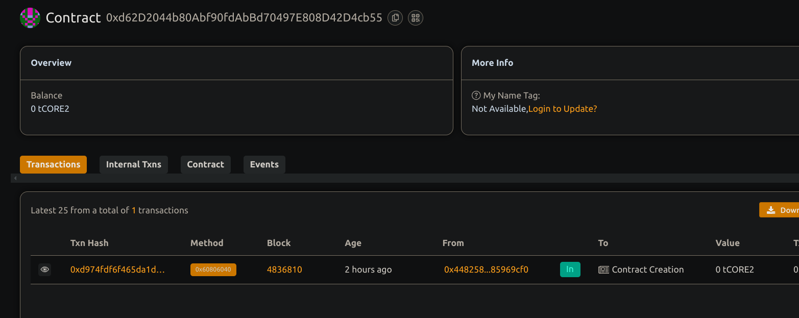

# SimpleMultiSigWallet

## Overview
**SimpleMultiSigWallet** is a decentralized smart contract wallet designed for enhanced security through multi-signature approvals. It ensures that no single owner can execute a transaction without the required number of confirmations, promoting collective decision-making and reducing the risk of unauthorized access.

## Vision
To deliver a user-friendly, secure, and reliable multisignature wallet for managing shared assets. Ideal for teams, DAOs, organizations, or joint accounts that require multi-party authorization for transactions.

## Core Features
- **Multi-owner Setup**: Assign multiple wallet owners with a customizable approval threshold.
- **Transaction Lifecycle**:
  - Submit: Owners can propose transactions.
  - Confirm: Owners confirm pending transactions.
  - Revoke: Owners can revoke their confirmation before execution.
  - Execute: Automatically executes when the required confirmations are reached.
- **Fund Management**: Send ETH or execute arbitrary function calls.
- **Transparency**: All actions and transaction history are recorded on-chain.

## Roadmap & Future Enhancements
- ✅ Support for ERC20 & ERC721 token transfers.
- ⚙️ Off-chain signature aggregation for improved gas efficiency.
- 🌐 Web3 user interface for intuitive interaction.
- 🔔 Real-time notifications and transaction analytics.
- ⏳ Implementation of timelocks and configurable spending limits.

## Contract Information
- **Deployed Address**: `0xd62D2044b80Abf90fdAbBd70497E808D42D4cb55`
- 
